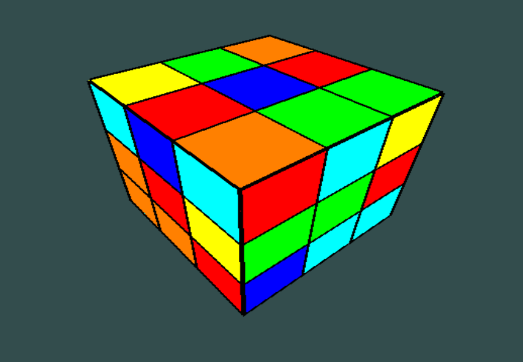

# Sem07-ComputerGraphics

### Course Overview
This repository contains the final project for the **Computer Graphics** course taken in my seventh semester. This course focused on the mathematical foundations of computer graphics, particularly in relation to **OpenGL**. Topics included vector operations, transformation matrices (rotation, scaling, translation), and perspective projections. The culmination of the course was this project: creating a functional **Rubik's Cube** in OpenGL that can be manipulated and solved using a pre-defined algorithm.

### Project Overview
The project involved building a Rubik’s Cube from scratch with OpenGL, implementing various transformation functions, and using an algorithm to solve the cube as efficiently as possible.

#### Key Features
- **Mathematical Transformations**: 
  - Implemented rotation matrices for the X, Y, and Z axes.
  - Scaling, translation, and perspective transformations, built from foundational math concepts.
- **Interactive Rubik’s Cube**: 
  - The cube can be rotated, manipulated, and reset.
  - Integrated a solver that uses an algorithm to solve the cube from any scrambled state.
- **Custom OpenGL Functions**:
  - Includes custom functions for matrix multiplications, vector operations, and shader management.

### Repository Structure

- **OpenGLCode.cpp**: The main file that initializes OpenGL, renders the Rubik’s Cube, and handles user interactions.
- **glad.c**: The OpenGL loader to handle graphics functions.
- **mylib.cpp** & **mylib.h**: Custom library files containing functions for transformations (rotations, scaling, translation), shader handling, and essential mathematical operations used throughout the project.
- **solver**: A directory containing the Rubik’s Cube solver algorithm (pre-built) used to solve the cube.

### Visuals
- **Cube.png**: An image showing the Rubik's Cube in a scrambled state.

  

- **Video Demonstration**: A video showing an animated interaction with the Rubik's Cube can be viewed [here](https://drive.google.com/file/d/17A45Fchh0o0d0fHYZMLtnhen0rOmMLfm/view?usp=sharing).

### Usage Instructions
To run the Rubik's Cube project:
1. Ensure you have **OpenGL** and **GLFW** installed.
2. Compile and run `OpenGLCode.cpp` with the additional files:
   ```bash
   g++ -o RubikCube OpenGLCode.cpp glad.c mylib.cpp -lGL -lglfw -ldl
   ./RubikCube
   ```
